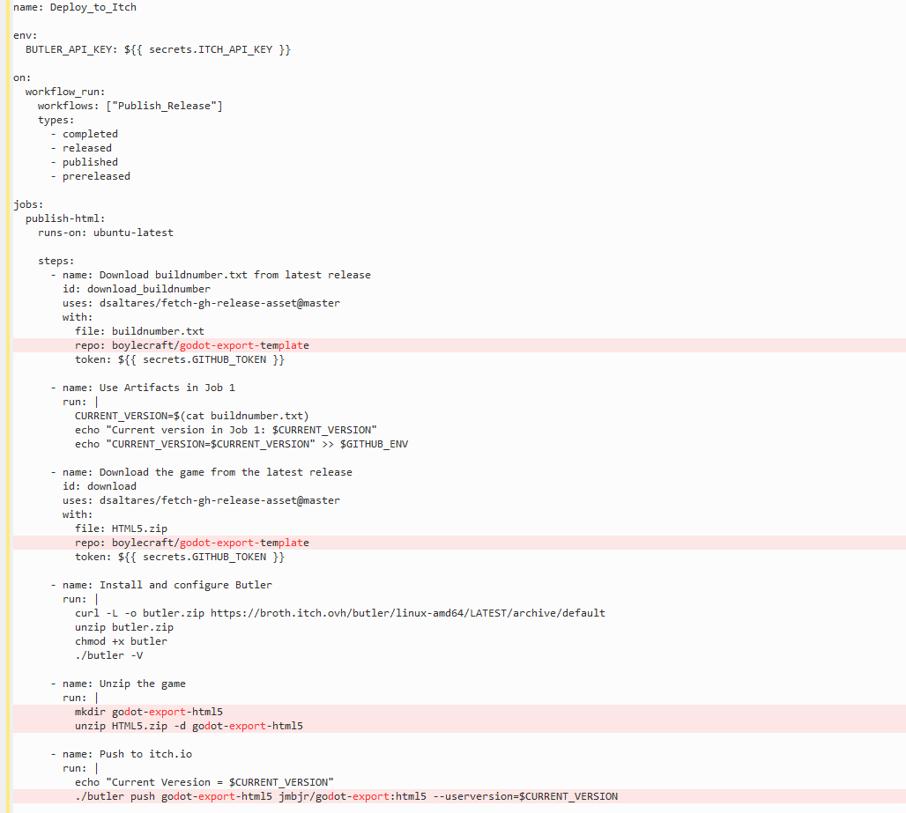
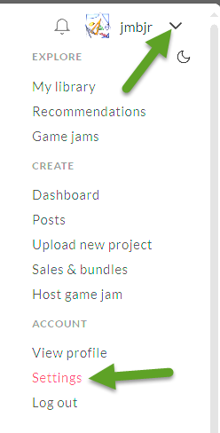
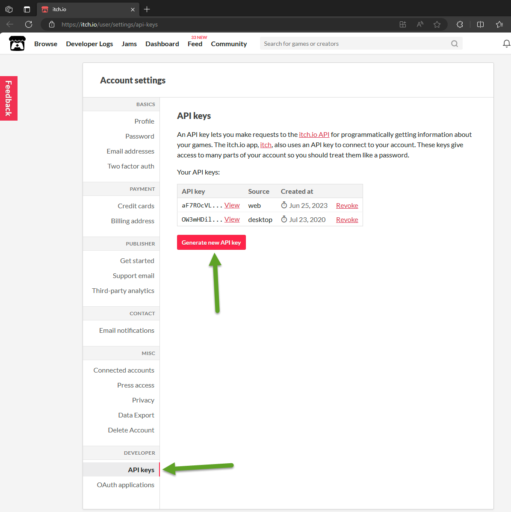
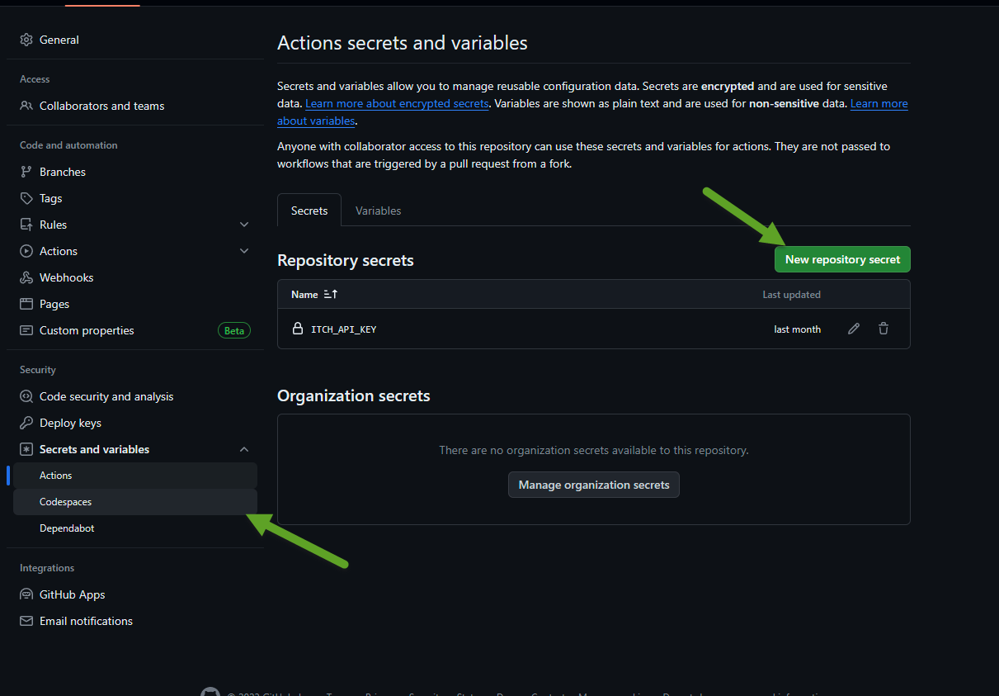
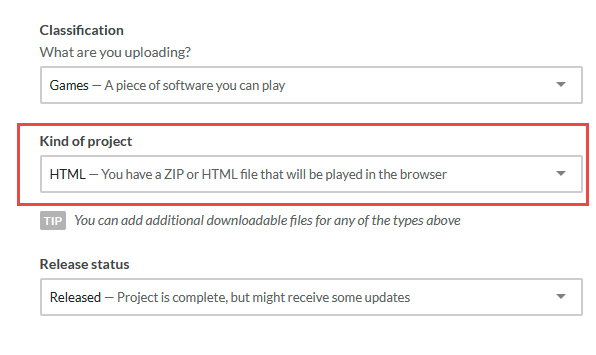
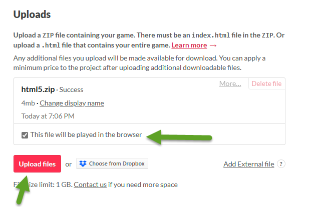
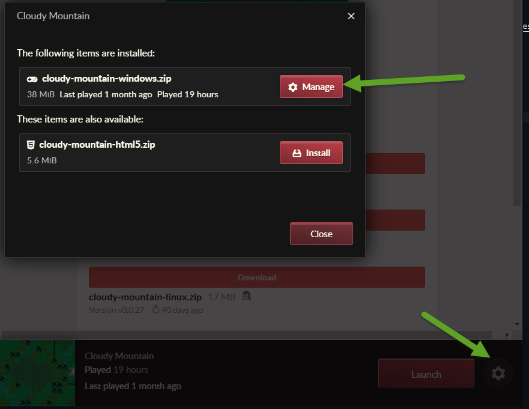
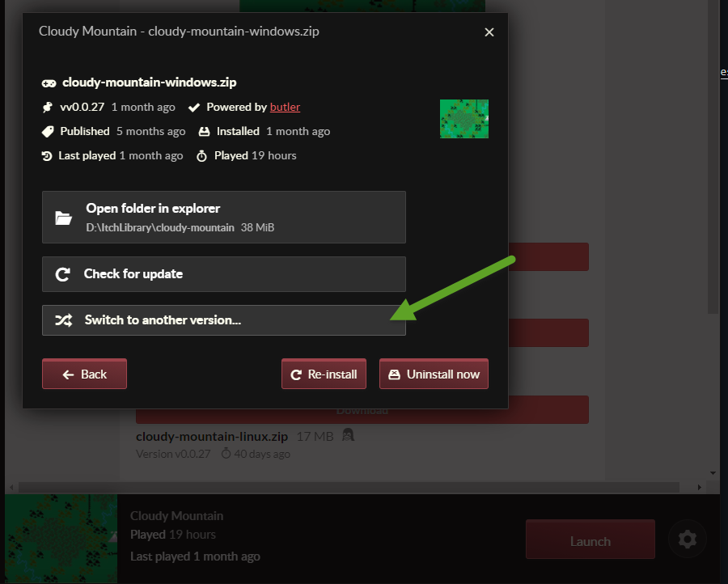
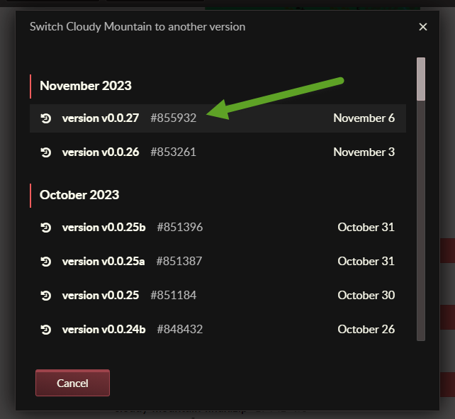

# Instructions for using this as a GitHub Template:
- NOTE: This was originally forked from [firebelley/godot-export on GitHub](https://github.com/firebelley/godot-export)
- I converted the fork to a github template and added an action to push releases to Itch.

## High Level:
1. Trigger a release by pushing a tag that starts with `v`.
  - You could edit this in .github/workflows/build.yml to set a different trigger
  - The release is built in GitHub using the official Godot releases and Export Templates (you will need to set the appropriate version)
  - The release also uses `git describe` to generate a unique version number that is used to label your releases on GitHub and on itch.
  - Currently the build process runs html5, windows, mac, and linux.
1. After a release is successfully created, .github/workflows/itch.yml runs to push the releases to your itch game page (via the itch Butler API)


## Instructions
1. Create a new repo using this as the template (you could also restructure your existing project and update the action files accordingly)
1. Edit ./github/workflows/build.yml to set the correct version of Godot you are using (you may need to check the [Godot Github for the actual release URLs](https://github.com/godotengine/godot-builds/releases/))
1. Create your Itch.io project page
1. Edit ./github/workflow/itch.yml:
  - Set the paths for your GitHub repo
  - Set the paths for your Itch repo
  - 
1. Create an Itch API key
  - Open your Itch Settings
  - 
  - Go to the Developer section and create a new API Key
  - 
  - Copy the key
1. Add your Itch API Key to your GitHub as a New Repository Secret. Name it "ITCH_API_KEY" to match the name in itch.yml
  - 

## At this point you should be able to create a release and tag it to trigger the actions.
- I think you can do this via "Draft New Release" on GitHub.com, but I generally do it via creating a tag locally and pushing.
  - In fact, whenever I try to do this via the GitHub Release page, I get an error in the pipeline complaining about a release validation failure
  - 

- Here's how I tag releases locally and push to GitHub in case you aren't familiar with tags
  1. `git tag -a v0.0.1 -m "New version/release"`
  1. `git push`
  1. `git push --tags`
- You can watch your builds on the actions page of your repo

## Itch.io Tip
- If you don't want to make your game public, you can make it restricted and set a password:
- 

## CAVEATS
- If your game is an html5 game (and if you are making a 2D game, it probably should be html5) you will need to prep your itch.io game page prior to pushing your first release
  - I don't know how to bypass this janky workflow. Please let me know if you find a better solution
  1. Before your first push to itch, set up your itch.io/game page as an HTML5 project
    - 
  2. Next, upload a zip file with valid html5 game files in it.
    - 
  3. Set this game to be played in a browser
  - If you don't do this, then when you upload your new files via the itch.yml action, the game won't be playable in the browser.
  - **IMPORTANT: after the first upload, you will need to go and delete this dummy html5.zip file and ensure your correct html5 build is the top listed one in your Uploads.**
  - 
  - 


## Bonus
- If you use the [Itch launcher app](https://itch.io/app) it will keep your game up-to-date (I think there's a bit of a lag, but you can manually force an update)
- But a cooler trick is that you can always revert back to an older version without having to mess with git or download an old release from GitHub.
1. 
1. 
1. 
- NOTE: It doesn't appear that you can go back more than a couple dozen versions. 
- NOTE: I also don't know how many old versions Itch.io keeps around


# ----------------------- Original README from firebelley/godot-export ----------------------------

# Godot Export
A workflow action to automatically export your Godot games. Supports standard and **Mono** builds!

## Contents
- [How it works](#how-it-works)
- [Setting Up Export Presets](#setting-up-export-presets)
- [Workflow Configuration](#workflow-configuration)
  - [Example Configuration](#example-configuration)
  - [Mono Builds](#mono-builds)
  - [Android Builds](#android-builds)
- [Custom Editor Settings](#custom-editor-settings)
- [Tips](#tips)
  - [Supply custom editor settings](#supplying-a-custom-editor-settings-file)
  - [Setup Windows Icons](#setup-windows-icons)
- [Example Projects](#example-projects)

## How it Works

This action automatically reads your `export_presets.cfg` file to determine which builds to make. Whenever this action runs each of your defined exports will run. The resulting executables can then be optionally attached to a release. See [the example configuration](#example-configuration).

## Setting Up Export Presets
Define at least 1 export preset by going to `Project -> Export` in the Godot editor and creating a configuration. Set the file name in the "Export Path" box. This is how the action knows how to name your binary. Notice how the below image has "win.exe" in the "Export Path" for my windows export. Your executables can be named however you like, as long as they include the appropriate extension `.exe`, `.x86_64`, etc.


**NOTE**: The file extension for the Mac OSX export must be anything but `.zip` for versions of Godot before 3.2. If the Mac OSX export file extension is `.zip` for a Godot version earlier than 3.2, then your project source files will be exported instead of a Mac application. [This was a known issue with the Godot command line export](https://github.com/godotengine/godot/issues/23073). For reference, I used a `.z` file extension to make it work for my Mac OSX builds.

## Workflow Configuration

### Action Inputs

| Input Name                            | Description                                                                                                                                                                                                                                                                          | Type      | Default | Required |
| ------------------------------------- | ------------------------------------------------------------------------------------------------------------------------------------------------------------------------------------------------------------------------------------------------------------------------------------ | --------- | ------- | -------- |
| `godot_executable_download_url`       | The **Linux Headless** version of Godot that you want to use to export your project. If you do not use the Linux Headless version exporting will fail.                                                                                                                               | `string`  |         | Yes      |
| `godot_export_templates_download_url` | The link to the `.tpz` archive of export templates.                                                                                                                                                                                                                                  | `string`  |         | Yes      |
| `relative_project_path`               | The relative path to the directory containing your `project.godot` file. If your `project.godot` file is at the root of your repository then this value should be `./`. Do _not_ include `project.godot` as part of this path.                                                       | `string`  |         | Yes      |
| `export_debug`                        | Export builds in debug mode.                                                                                                                                                                                                                                                         | `boolean` | `false` | No       |
| `archive_output`                      | Archive each export into a `.zip` file.                                                                                                                                                                                                                                              | `boolean` | `false` | No       |
| `archive_root_folder`                 | Place exported files under a root folder when archiving, rather than placing the files themselves at the root of the archive.                                                                                                                                                        | `boolean` | `false` | No       |
| `relative_export_path`                | Move exports to the provided directory relative to the root of the Git repository. **NOTE**: This setting is overridden by `use_preset_export_path`.                                                                                                                                 | `string`  | `''`    | No       |
| `use_preset_export_path`              | Move exports to the directory defined in `export_presets.cfg` relative to `relative_project_path`. In other words, exports will use the export path specified in the export preset in relation to the location of the `project.godot` file. Prioritized over `relative_export_path`. | `boolean` | `false` | No       |
| `wine_path`                           | The absolute path to the wine binary. If specified, Godot will use this to run rcedit to update Windows exe icons. See the [setup Windows icons](#setup-windows-icons) example configuration.                                                                                        | `string`  | `''`    | No       |
| `verbose`                             | Use the `--verbose` flag when exporting.                                                                                                                                                                                                                                             | `boolean` | `false` | No       |
| `use_godot_3`                         | Build using Godot 3 executable. **NOTE**: `godot_executable_download_url` and `godot_export_templates_download_url` still need to be configured to download the correct version.                                                                                                     | `boolean` | `false` | No       |
| `export_as_pack`                      | Export project files as a .pck file                                                                                                                                                                                                                                                  | `boolean` | `false` | No       |


### Action Outputs

| Output Name         | Description                                                                                                                                                                                                       | Type     |
| ------------------- | ----------------------------------------------------------------------------------------------------------------------------------------------------------------------------------------------------------------- | -------- |
| `build_directory`   | The directory containing the raw (unarchived) exported files. Note that the inputs `relative_export_path` and `use_preset_export_path` do not change this output value.                                           | `string` |
| `archive_directory` | The directory containing archived exports. This directory will be empty if `archive_output` is not set. Note that the inputs `relative_export_path` and `use_preset_export_path` do not change this output value. | `string` |


### Example Configuration
Below is a sample workflow configuration file utilizing this action. This example workflow could be defined in `.github/workflows/main.yml`. For more information about defining workflows see [the workflow docs](https://help.github.com/en/actions/automating-your-workflow-with-github-actions/configuring-a-workflow).

This workflow will export your game when a tag is pushed, archive the files, and create a release containing the archives.

```yml
# Whenever a tag push matching pattern "v*" then run the job
on: 
  push:
    tags:
      - "v*"

jobs:
  # job id, can be anything
  export_game:
    # Always use ubuntu-latest for this action
    runs-on: ubuntu-latest
    # Add permission for release creation. Can be made narrower according to your needs
    permissions: write-all
    # Job name, can be anything
    name: Export Game
    steps:
      # Always include the checkout step so that 
      # your project is available for Godot to export
    - name: checkout
      uses: actions/checkout@v3.3.0
  
    - name: export game
      id: export
      # Use latest version (see releases for all versions)
      uses: firebelley/godot-export@v5.1.0
      with:
        # Defining all the required inputs
        godot_executable_download_url: https://downloads.tuxfamily.org/godotengine/4.0/Godot_v4.0-stable_linux.x86_64.zip
        godot_export_templates_download_url: https://downloads.tuxfamily.org/godotengine/4.0/Godot_v4.0-stable_export_templates.tpz
        relative_project_path: ./
        archive_output: true

      # This release action has worked well for me. However, you can most likely use any release action of your choosing.
      # https://github.com/ncipollo/release-action
    - name: create release
      uses: ncipollo/release-action@v1.12.0
      with:
        token: ${{ secrets.GITHUB_TOKEN }}
        generateReleaseNotes: true
        tag: ${{ github.ref_name }}
        artifacts: ${{ steps.export.outputs.archive_directory }}/*
```

## Custom Editor Settings
Some Godot configurations are editor-based and not project-based. This includes items like Android paths. This repository provides a [base editor settings](./dist/editor_settings-4.tres) that will be used by default when exporting your games. However, you can supply a custom editor settings configuration file by simply copying your custom editor settings file to `~/.config/godot/editor_settings-4.tres` _before_ this action runs. This action will not overwrite an existing `editor_settings-4.tres` file.

## Mono Builds
Mono builds do not require additional configuration. However, if you want to change the build tool that is used (currently defaults to `dotnet cli`) then you need to [supply your own editor settings](#custom-editor-settings) with the line `mono/builds/build_tool`. This value corresponds to the build tool dropdown in the editor settings window at `Editor Settings -> Mono -> Builds -> Build Tool`. You can look at your local `editor_settings-3.tres` to see what this value should be if you want to match the build tool used during local development.

## Android Builds
For Android builds, use the [setup-android](https://github.com/android-actions/setup-android) action before this one in your workflow. [The default editor settings file](./dist/editor_settings-3.tres) used by this action already provides a default path to the Android SDK. If your path is different then [supply your own editor settings file](#custom-editor-settings).


## Tips

### Supplying a Custom Editor Settings File
Include the following step before this action. For example:
```yml
# Above this line is the workflow job setup
- name: use custom editor settings
  run: |
    mkdir -p ~/.config/godot
    cp ~/path/to/my/editor_settings-3.tres ~/.config/godot/
# Note that you can use ${{ github.workspace }} to get the default location of your checked-out repository
# Use firebelley/godot-export sometime after the above step
```

### Setup Windows Icons
In order to configure this action to update your game's Windows exe icon, include the following configuration:
```yml
- name: install wine
  id: wine_install
  run: |
    sudo apt install wine64
    echo "WINE_PATH=$(which wine64)" >> $GITHUB_OUTPUT

# Any other intermediate steps can go here

- name: export game
  uses: firebelley/godot-export@v5.1.0
  with:
    # ...supply your other options here
    wine_path: ${{ steps.wine_install.outputs.WINE_PATH }} # set the wine path here which is the output of the wine_install step
```

### Example Projects
See the [example projects](./examples/README.md) for more info.
